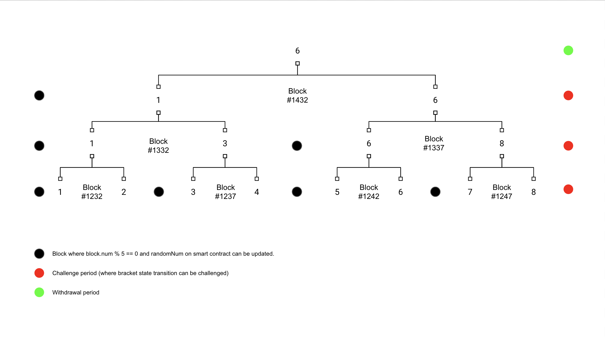

# compose.art

## death.finance 

### Architecture

_Note: Everything written here is a best effort / work in progress and is subject to change based on future learnings..._

The first thing to understand about this architecture, is that, much like NFTs, the blockchain is chiefly used for auditability and verification - we store as little information as possible on the blockchain. This is made possible via a provenance hash (similar to what you'll find in [BAYC](https://boredapeyachtclub.com/#/provenance)) which will be the hash of all fighter stats, fighter ids, initial bracket matchups / subsequent matchups, and the block numbers during which each match will occur. Effectively, we are locking in what is going to occur and are telling people that we are going to stick to this schedule and will provide multiple challenge periods after each bracket state transition for protests in the event that we have somehow defrauded our users.

When I say "bracket state transition", I mean the process of going from 1024 fighters to 512, 512 to 256, etc... we are going to be storing which fighters are advancing as 4 uint256s where each bit symbolizes a fighter - if the bit is a 1, they have made it to this next round, if 0, they have been eliminated. Here is a simple example of this using 4 fighters instead of 1024:

- Round 0: 1 1 1 1 (all 4 fighters are fighting in this round)
- Round 1: 0 1 1 0 (fighters 1, 2 are fighting in this round)
- Round 2: 0 0 1 0 (fighter 2 is fighting in this round)

And here is a basic diagram of what I just mentioned, below:



Before we begin each "round", users will be able to place bets on fighters that they believe will win the bracket. The payout / mechanics for this are a work in progress. After each round begins, betting will cease and fights will begin. 
Given that the blockchain is deterministic and individuals can predict the outcome of individual fights, we provide a randomness variable that is used to determine the outcome of fights which can be altered by anyone. This is our version of "publicly-sourced randomness". The smart contract(s) we are deploying also provide a free method for verifying that each fight occurred at the exact block which we said it would occur at and consumed the current randomness variable at that block - this function is free-of-charge for anyone to execute. 

After each "round", we will submit a bracket state change to the smart contract and both a challenge period and new betting period will begin. The challenge period allows users to independently verify the state-change and ensure that there was no defrauding of the bracket, on our part.

This process continues until there is only two fighters remaining, at which point we might want to reconsider how we do randomness because that fight can 100% be rigged, but maybe this is fine...

#### Smart Contracts

FightClub.sol is responsible for:
- Provenance hash for super-bracket / fighter stats.
- Publicly-sourced randomness (for fights).
- Fight replays (for state-transition verification).
- Fighter advancement
- Bet placement
- Bet payouts / withdrawals
- Fighter registration / claiming your fighter

#### Firebase Functions

TBD

#### React Frontend

TBD

#### Commands

```shell
npx hardhat accounts
npx hardhat compile
npx hardhat clean
npx hardhat test
npx hardhat node
npx hardhat run scripts/deploy.js
npx hardhat run scripts/deploy.js --network goerli
npx hardhat test --network goerli
npx hardhat help
```
